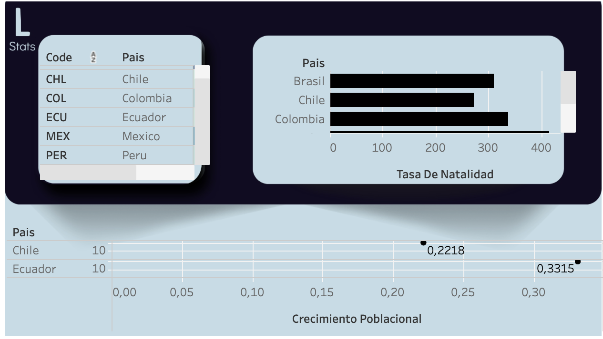

# Análisis de datos en Tableau

Ficha Técnica: Proyecto de Análisis de Datos

Título del Proyecto: Análisis de datos en excel y Tableau

Objetivo:
Realizar un dashboard con Tableau

Equipo:
Trabajo Individual.

Herramientas y Tecnologías:

- Tableau.
- Google Slides.
- Google Sheets.

Procesamiento y análisis:
- limpieza de datos
- exploración de datos
- Técnica de Análisis de datos
  
Resultados y Conclusiones:
Se hizo un análisis estadistico poblacional.

Dashboard

Limitaciones/Próximos Pasos:
Identifica y describe cualquier limitación o desafío encontrado durante el proyecto.
Sugiere posibles próximos pasos para extender o mejorar el proyecto de análisis de datos.

Enlaces de interes:

[Tableau](https://public.tableau.com/views/Libro1-labp1/Dashboard1?:language=es-ES&publish=yes&:sid=&:redirect=auth&:display_count=n&:origin=viz_share_link)
[google slides](https://docs.google.com/presentation/d/1nUUV4YS0AULAgriCDOvPXqRgCtToOu08HYXeawegA-w/edit?usp=sharing)
